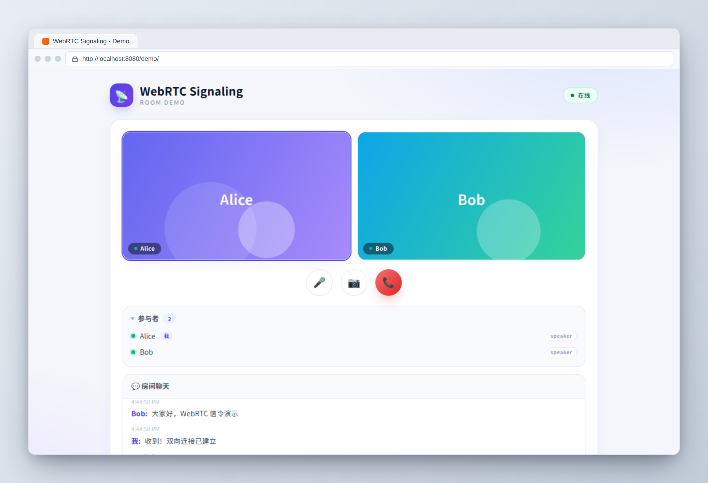

**English** | [中文](#chinese)

<a id="top"></a>

# WebRTC Signaling

**A production-style WebRTC signaling service** — implemented from scratch in Go, focusing on backend engineering practices such as authentication, horizontal scaling, observability, and deployment. A personal practice project that, together with its sister project [webrtc-call](https://github.com/build-workbench/webrtc-call), forms a contrasting learning path of "frontend call client vs. backend signaling service".

[](https://go.dev/)
[](https://github.com/build-workbench/webrtc-signaling/actions/workflows/ci.yml)
[](LICENSE)

## Product Screenshots

Demo UI in light mode (`web/index.html` demo frontend). Both peers, Alice / Bob, join the same room; the screenshot shows video feeds, the participant list, and room chat. The UI fonts are Resource Han Rounded CN (Chinese) and Code New Roman (English/numbers):



## Project Positioning and Target Scenarios

WebRTC media streams connect P2P directly between browsers, but "who is in which room, how peers discover each other, and how SDP / ICE candidates are exchanged" requires a signaling channel. **This repository is that signaling backend**, deliberately written to production engineering standards:

- **Typical scenarios**: online classrooms / live-stream interaction (speakers present, viewers only watch, moderators manage), small-scale meetings and collaboration tools, and the backend of any RTC application that needs "rooms + role permissions + message routing"
- **Learning / portfolio positioning**: every feature is hand-written and comes with tests, serving as a reference starting point for WebRTC signaling and Go backend engineering practice, rather than an out-of-the-box cloud product
- **Boundaries (honest disclosure)**:
  - Signaling only; media streams never pass through the server (P2P); STUN is built in, **no TURN** — connections may fail in strict NAT environments
  - No user system: Join Tokens are issued manually via the admin API (`X-Admin-Key`); no third-party IdP is integrated
  - `web/` is a single-file demo frontend, not a production UI
  - No large-scale load testing or real cluster verification has been done; this is a practice project

### Sister Projects

| Project | Positioning |
|------|------|
| [webrtc-call](https://github.com/build-workbench/webrtc-call) | **Frontend call client**: native browser WebRTC audio/video calls (1v1 / Mesh multi-party); experience the full P2P call flow first |
| **webrtc-signaling (this repo)** | **Engineering implementation**: adds authentication, horizontal scaling, observability, deployment, and testing on top of signaling |

## Features

### Signaling Core
- **WebSocket signaling** -- room management (capacity limit, automatic cleanup of empty rooms), SDP/ICE message routing (offer / answer / trickle), unified message envelope (`id` / `version` / `roomId` / `from` / `to` / `ts`)
- **Role permissions** -- viewer / speaker / moderator three-tier roles: viewers cannot send media signaling, only moderators can mute others, and the join payload cannot escalate privileges (the role in the JWT is authoritative)

### Engineering Practices
- **JWT authentication** -- Join Token issuing and verification (HS256), constant-time comparison of the admin key, Token TTL tightening
- **Redis Pub/Sub horizontal scaling** -- local-first routing with automatic cross-node fallback; per-room subscription + reference counting + nodeID filtering of self messages
- **Prometheus metrics** -- `signal_*` namespace: connections / rooms / participants / message send-receive / errors / processing latency
- **Structured logging** -- zap JSON logs, Request-ID tracing
- **Middleware** -- panic recovery, per-connection rate limiting, CORS Origin whitelist, security response headers, access logging
- **Testing and CI** -- covers core paths such as permissions, concurrency, and Origin restrictions; CI runs `go build` + `go vet` + `go test -race`

### Deployment and Operations
- **Docker deployment** -- multi-stage build + Distroless non-root image, one-command docker-compose orchestration (server + redis + health checks)
- **Operations capabilities** -- graceful shutdown (actively closes existing WebSocket connections), `/healthz` liveness probe, `/readyz` readiness probe (checks Redis), in-container `healthcheck` subcommand

## Architecture

```
cmd/server/main.go              应用入口
internal/
├── auth/                       JWT 签发与验证
├── config/                     环境变量配置
├── httpapi/
│   ├── server.go               HTTP/WS 服务器组装
│   ├── router.go               消息路由（本地优先 + Redis Bus 跨节点 fallback）
│   ├── ws.go                   WebSocket 会话管理
│   ├── handler_room.go         REST API：房间 CRUD / Join Token 签发
│   ├── handler_health.go       健康探针与 ICE 服务器配置
│   ├── middleware.go           中间件链
│   ├── permission.go           角色权限策略
│   ├── redisbus.go             Redis Pub/Sub 实现
│   └── utils.go                工具函数
├── observability/metrics.go    Prometheus 指标
└── room/manager.go             房间与 Peer 生命周期管理
web/index.html                  单文件 Demo 前端
```

## Quick Start

### Single Instance

```bash
export SIGNAL_JWT_SECRET="change-me-to-a-long-random-secret"
make run
```

Open `http://localhost:8080/demo`, enter a room and a nickname, and try it out.

### Multiple Instances (Redis Scaling)

```bash
export SIGNAL_JWT_SECRET="change-me-to-a-long-random-secret"
cd docker && docker compose up --build
```

## Self-Hosting Guide

The production-style deployment path is Docker Compose (single node works fine; Redis is included and enables multi-node scaling later):

```bash
cd docker
SIGNAL_JWT_SECRET="$(openssl rand -hex 32)" \
SIGNAL_ADMIN_KEY="$(openssl rand -hex 16)" \
docker compose up -d --build
```

The service listens on `${SIGNAL_PORT:-8080}` with `/healthz`, `/readyz` and Prometheus `/metrics` wired to the container healthcheck.

Minimal production checklist:

- **HTTPS in front**: browsers require a secure context for `getUserMedia`, so terminate TLS at a reverse proxy that forwards WebSocket upgrades:

  ```caddy
  rtc.example.com {
      reverse_proxy 127.0.0.1:8080
  }
  ```

  ```nginx
  # nginx: remember the upgrade headers and a long read timeout
  location / {
      proxy_pass http://127.0.0.1:8080;
      proxy_http_version 1.1;
      proxy_set_header Upgrade $http_upgrade;
      proxy_set_header Connection "upgrade";
      proxy_read_timeout 86400s;
  }
  ```

- **Lock down origins and the admin API**: set `SIGNAL_ALLOWED_ORIGINS` to your frontend origin(s), and never expose the admin key publicly — `X-Admin-Key` authorizes Join Token issuance (see the API reference below):

  ```bash
  curl -X POST https://rtc.example.com/api/v1/rooms \
       -H "Content-Type: application/json" \
       -d '{"id":"standup","maxParticipants":8}'
  curl -X POST https://rtc.example.com/api/v1/rooms/standup/join-token \
       -H "X-Admin-Key: $SIGNAL_ADMIN_KEY" \
       -H "Content-Type: application/json" \
       -d '{"userId":"alice","displayName":"Alice","role":"speaker","ttlSeconds":3600}'
  ```

- **Know the boundaries** (honest disclosure, see also [Project Positioning](#project-positioning-and-target-scenarios)): signaling only — media is P2P and never transits the server; **no TURN**, so strict-NAT peers may fail to connect (self-host a coturn and add it via `SIGNAL_STUN`/`/ice-servers` if you need relaying); **no user system** — Join Tokens are issued manually; the cluster path is exercised by tests but has not been load-tested at scale.

Pair this backend with the [webrtc-call](https://github.com/build-workbench/webrtc-call) frontend client, or point your own RTC frontend at the WebSocket signaling protocol documented below.

## Configuration

| Variable | Default | Description |
|------|--------|------|
| `SIGNAL_JWT_SECRET` | - | JWT signing secret (**required**) |
| `SIGNAL_ADDR` | `:8080` | Listen address |
| `SIGNAL_LOG_LEVEL` | `info` | Log level |
| `SIGNAL_ADMIN_KEY` | - | Admin API key (for issuing Join Tokens, optional) |
| `SIGNAL_ALLOWED_ORIGINS` | - | Origin whitelist (comma-separated) |
| `SIGNAL_REDIS_ADDR` | - | Redis address; when non-empty, multi-node scaling is enabled |
| `SIGNAL_STUN` | `stun:stun.l.google.com:19302` | STUN server list |

## API Reference

### REST Endpoints

Base URL: `/api/v1`

| Method | Path | Description |
|------|------|------|
| POST | `/rooms` | Create a room |
| GET | `/rooms/{id}` | Query a room |
| POST | `/rooms/{id}/join-token` | Issue a Join Token (requires `X-Admin-Key`) |
| GET | `/ice-servers` | ICE server configuration |
| GET | `/healthz` | Liveness probe |
| GET | `/readyz` | Readiness probe (checks Redis) |
| GET | `/metrics` | Prometheus metrics |

### WebSocket Signaling

Connect: `GET /ws/v1?token=<JWT>`; after connecting, a `join` message must be sent first.

Message envelope (`id`/`ts`/`from` are filled in by the server):

```json
{ "id": "uuid", "version": "v1", "type": "offer", "to": "peer-b", "from": "peer-a", "ts": 1707800000000, "payload": {} }
```

| Client -> Server | Description |
|---|---|
| `join` | Join a room |
| `offer` / `answer` | SDP negotiation |
| `trickle` | ICE candidates |
| `chat` | Text message |
| `mute` / `unmute` | Mute control (moderators can manage others) |
| `leave` | Leave the room |

| Error code | Meaning |
|---|---|
| 2001 | Invalid message format |
| 2002 | Unauthenticated or Token expired |
| 2003 | Insufficient permissions |
| 2004 | Room does not exist |
| 2006 | Unsupported message type |
| 2007 | Rate limit exceeded |
| 2010 | Abnormal state or room is full |
| 3000 | Internal server error |

## License

[MIT](LICENSE)

---
<a id="chinese"></a>
[English](#top) | **中文**

# WebRTC Signaling

**生产风格（production-style）的 WebRTC 信令服务** —— 用 Go 从零实现，聚焦认证、水平扩展、可观测性与部署等后端工程实践。个人练手作品，与姊妹项目 [webrtc-call](https://github.com/build-workbench/webrtc-call) 形成「前端通话客户端 vs 后端信令服务」的对照学习路径。

[](https://go.dev/)
[](https://github.com/build-workbench/webrtc-signaling/actions/workflows/ci.yml)
[](LICENSE)

## 产品截图

浅色模式演示界面（`web/index.html` 演示前端）。双端 Alice / Bob 加入同一房间，截图展示视频画面、参与者列表与房间聊天；界面字体使用 Resource Han Rounded CN（中文）与 Code New Roman（英文/数字）：


## 项目定位与场景目标

WebRTC 的媒体流在浏览器之间 P2P 直连，但"谁在哪个房间、如何互相发现、如何交换 SDP / ICE 候选"需要一条信令通道。**本仓库就是这个信令后端**，并刻意按生产工程的规格来写：

- **典型场景**：在线课堂 / 直播互动（speaker 发言、viewer 只观看、moderator 管控）、小规模会议与协作工具，以及任何需要"房间 + 角色权限 + 消息路由"的 RTC 应用后端
- **学习 / 作品定位**：每个特性均为手写实现并配套测试，作为 WebRTC 信令与 Go 后端工程实践的参考起点，而非开箱即用的云产品
- **边界（诚实声明）**：
  - 只做信令，媒体流不经过服务端（P2P）；内置 STUN，**不含 TURN**，严格 NAT 环境下可能无法打通
  - 无用户体系：Join Token 由管理 API（`X-Admin-Key`）手动签发，未接入第三方 IdP
  - `web/` 为单文件演示前端，非生产 UI
  - 未做大规模压测与集群真实验证，练手性质

### 姊妹项目

| 项目 | 定位 |
|------|------|
| [webrtc-call](https://github.com/build-workbench/webrtc-call) | **前端通话客户端**：浏览器原生 WebRTC 音视频通话（1v1 / Mesh 多人），先体验 P2P 通话全流程 |
| **webrtc-signaling（本仓库）** | **工程化实现**：在信令之上补齐认证、水平扩展、可观测性、部署与测试 |

## 功能特性

### 信令核心
- **WebSocket 信令** -- 房间管理（人数上限、空房自动清理）、SDP/ICE 消息路由（offer / answer / trickle）、统一消息信封（`id` / `version` / `roomId` / `from` / `to` / `ts`）
- **角色权限** -- viewer / speaker / moderator 三级角色：viewer 不能发送媒体信令，仅 moderator 可静音他人，join payload 无法提权（以 JWT 中的角色为准）

### 工程实践
- **JWT 认证** -- Join Token 签发与验证（HS256）、管理密钥常量时间比较、Token TTL 收敛
- **Redis Pub/Sub 水平扩展** -- 本地优先路由，跨节点自动 fallback；按房间订阅 + 引用计数 + nodeID 过滤自消息
- **Prometheus 指标** -- `signal_*` 命名空间：连接 / 房间 / 参与者 / 消息收发 / 错误 / 处理延迟
- **结构化日志** -- zap JSON 日志、Request-ID 链路追踪
- **中间件** -- panic recovery、每连接速率限制、CORS Origin 白名单、安全响应头、访问日志
- **测试与 CI** -- 覆盖权限、并发、Origin 限制等核心链路；CI 执行 `go build` + `go vet` + `go test -race`

### 部署与运维
- **Docker 部署** -- 多阶段构建 + Distroless 非 root 镜像，docker-compose 一键编排（server + redis + 健康检查）
- **运维能力** -- 优雅关闭（主动关闭存量 WebSocket）、`/healthz` 存活探针、`/readyz` 就绪探针（检测 Redis）、容器内 `healthcheck` 子命令

## 架构

```
cmd/server/main.go              应用入口
internal/
├── auth/                       JWT 签发与验证
├── config/                     环境变量配置
├── httpapi/
│   ├── server.go               HTTP/WS 服务器组装
│   ├── router.go               消息路由（本地优先 + Redis Bus 跨节点 fallback）
│   ├── ws.go                   WebSocket 会话管理
│   ├── handler_room.go         REST API：房间 CRUD / Join Token 签发
│   ├── handler_health.go       健康探针与 ICE 服务器配置
│   ├── middleware.go           中间件链
│   ├── permission.go           角色权限策略
│   ├── redisbus.go             Redis Pub/Sub 实现
│   └── utils.go                工具函数
├── observability/metrics.go    Prometheus 指标
└── room/manager.go             房间与 Peer 生命周期管理
web/index.html                  单文件 Demo 前端
```

## 快速开始

### 单实例

```bash
export SIGNAL_JWT_SECRET="change-me-to-a-long-random-secret"
make run
```

打开 `http://localhost:8080/demo`，输入房间和昵称即可体验。

### 多实例（Redis 扩展）

```bash
export SIGNAL_JWT_SECRET="change-me-to-a-long-random-secret"
cd docker && docker compose up --build
```

## 自部署指南

推荐的生产级部署路径是 Docker Compose（单节点即可运行；Redis 已包含在编排内，之后可以平滑扩展到多节点）：

```bash
cd docker
SIGNAL_JWT_SECRET="$(openssl rand -hex 32)" \
SIGNAL_ADMIN_KEY="$(openssl rand -hex 16)" \
docker compose up -d --build
```

服务监听 `${SIGNAL_PORT:-8080}`，`/healthz`、`/readyz` 与 Prometheus `/metrics` 已接入容器健康检查。

最小生产清单：

- **前面加 HTTPS**：浏览器要求安全上下文才能调用 `getUserMedia`，请在反向代理上终结 TLS 并转发 WebSocket 升级：

  ```caddy
  rtc.example.com {
      reverse_proxy 127.0.0.1:8080
  }
  ```

  ```nginx
  # nginx：记得带升级请求头，并拉长读超时
  location / {
      proxy_pass http://127.0.0.1:8080;
      proxy_http_version 1.1;
      proxy_set_header Upgrade $http_upgrade;
      proxy_set_header Connection "upgrade";
      proxy_read_timeout 86400s;
  }
  ```

- **收紧来源与管理 API**：把 `SIGNAL_ALLOWED_ORIGINS` 设为你的前端来源；管理密钥不要对外暴露——`X-Admin-Key` 用于签发 Join Token（见下方 API 参考）：

  ```bash
  curl -X POST https://rtc.example.com/api/v1/rooms \
       -H "Content-Type: application/json" \
       -d '{"id":"standup","maxParticipants":8}'
  curl -X POST https://rtc.example.com/api/v1/rooms/standup/join-token \
       -H "X-Admin-Key: $SIGNAL_ADMIN_KEY" \
       -H "Content-Type: application/json" \
       -d '{"userId":"alice","displayName":"Alice","role":"speaker","ttlSeconds":3600}'
  ```

- **了解边界**（如实声明，另见[项目定位](#项目定位与场景目标)）：本服务只做信令——媒体流 P2P 直连、不经过服务器；**无 TURN**，严格 NAT 环境可能连不通（如需中继，自建 coturn 并通过 `SIGNAL_STUN`/`/ice-servers` 下发）；**无用户系统**，Join Token 靠管理 API 手工签发；集群路径有测试覆盖，但未做过大规模压测。

将此后端与 [webrtc-call](https://github.com/build-workbench/webrtc-call) 前端呼叫客户端配对使用，或按下方文档的 WebSocket 信令协议接入你自己的 RTC 前端。

## 配置

| 变量 | 默认值 | 说明 |
|------|--------|------|
| `SIGNAL_JWT_SECRET` | - | JWT 签名密钥（**必填**） |
| `SIGNAL_ADDR` | `:8080` | 监听地址 |
| `SIGNAL_LOG_LEVEL` | `info` | 日志级别 |
| `SIGNAL_ADMIN_KEY` | - | 管理 API 密钥（签发 Join Token 用，可选） |
| `SIGNAL_ALLOWED_ORIGINS` | - | Origin 白名单（逗号分隔） |
| `SIGNAL_REDIS_ADDR` | - | Redis 地址；非空即启用多节点扩展 |
| `SIGNAL_STUN` | `stun:stun.l.google.com:19302` | STUN 服务器列表 |

## API 参考

### REST 端点

Base URL：`/api/v1`

| 方法 | 路径 | 说明 |
|------|------|------|
| POST | `/rooms` | 创建房间 |
| GET | `/rooms/{id}` | 查询房间 |
| POST | `/rooms/{id}/join-token` | 签发 Join Token（需 `X-Admin-Key`） |
| GET | `/ice-servers` | ICE 服务器配置 |
| GET | `/healthz` | 存活探针 |
| GET | `/readyz` | 就绪探针（检测 Redis） |
| GET | `/metrics` | Prometheus 指标 |

### WebSocket 信令

连接：`GET /ws/v1?token=<JWT>`，连接后必须先发 `join` 消息。

消息信封（`id`/`ts`/`from` 由服务端填充）：

```json
{ "id": "uuid", "version": "v1", "type": "offer", "to": "peer-b", "from": "peer-a", "ts": 1707800000000, "payload": {} }
```

| 客户端 -> 服务端 | 说明 |
|---|---|
| `join` | 加入房间 |
| `offer` / `answer` | SDP 协商 |
| `trickle` | ICE 候选 |
| `chat` | 文本消息 |
| `mute` / `unmute` | 静音控制（moderator 可管控他人） |
| `leave` | 离开房间 |

| 错误码 | 含义 |
|---|---|
| 2001 | 消息格式不合法 |
| 2002 | 未认证或 Token 过期 |
| 2003 | 权限不足 |
| 2004 | 房间不存在 |
| 2006 | 不支持的消息类型 |
| 2007 | 超出速率限制 |
| 2010 | 状态异常或房间已满 |
| 3000 | 服务端内部错误 |

## 许可证

[MIT](LICENSE)
