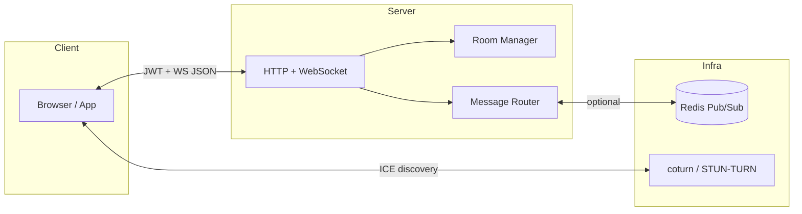
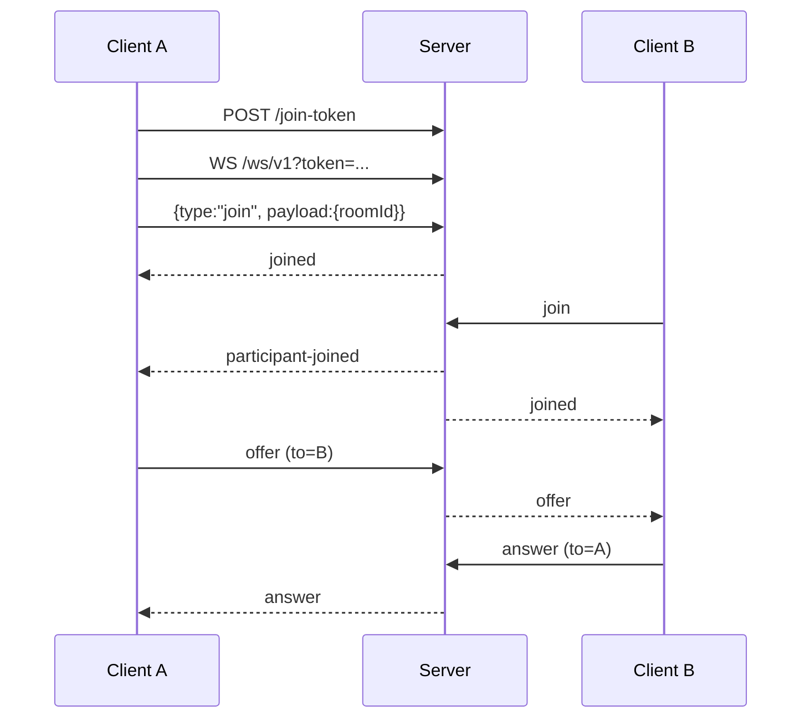

# 系统设计文档
{: .no_toc }

Aurora Signal 是一个 **Go 编写的 WebRTC 信令服务**。它只负责房间、鉴权、消息路由和基础控制，不负责媒体转发、录制或复杂业务编排。

<details open markdown="block">
  <summary>目录</summary>
  {: .text-delta }
- TOC
{:toc}
</details>

---

## 1. 目标与非目标

### 目标

- 为浏览器或 App 提供房间级 WebRTC 信令能力
- 提供 Join Token、房间查询、ICE 下发、健康检查与指标
- 支持单节点部署，以及通过 Redis Pub/Sub 进行多节点消息扇出

### 非目标

- 不做 SFU / MCU，不转发媒体流
- 不做录制、回放、文件传输或聊天系统扩展
- 不做多租户隔离、灰度路由、配置中心或第二套协议栈

---

## 2. 架构概览

| 组件 | 职责 |
|:--|:--|
| `cmd/server` | 进程入口、配置加载、日志、优雅关闭 |
| `internal/httpapi` | REST、WebSocket、Demo 静态文件 |
| `internal/auth` | JWT join token 签发与校验 |
| `internal/room` | 房间与参与者内存状态 |
| `internal/router` | 本地投递与 Redis 转发路由 |
| `internal/store/redis` | 可选 Redis Pub/Sub 总线 |
| `internal/observability` | Prometheus 指标 |
| `web/` | 本地演示页面 |



---

## 3. 运行时模型

### Room

| 字段 | 类型 | 说明 |
|:--|:--|:--|
| `id` | string | 房间 ID |
| `maxParticipants` | int | 可选人数上限 |
| `createdAt` | time | 创建时间 |
| `participants` | map | 当前连接中的参与者 |

### Participant

| 字段 | 类型 | 说明 |
|:--|:--|:--|
| `id` | string | peer ID |
| `userId` | string | 业务用户 ID |
| `role` | string | `viewer` / `speaker` / `moderator` |
| `displayName` | string | 显示名 |
| `joinedAt` | time | 加入时间 |

### 生命周期

- `POST /api/v1/rooms` 可预创建房间
- WebSocket `join` 会在需要时创建房间并加入
- 最后一个参与者离开时，房间会立刻删除
- 对于“已创建但无人加入”的空房间，后台清理协程会按 TTL 回收

---

## 4. 请求与消息流

1. 客户端通过 `POST /api/v1/rooms/{id}/join-token` 获取 JWT
2. 客户端使用 `GET /ws/v1?token=<JWT>` 建立连接
3. 首条消息必须是 `join`
4. 服务端返回 `joined`，并向房间其他成员广播 `participant-joined`
5. 后续 `offer` / `answer` / `trickle` / `chat` / `mute` / `unmute` 由路由器按 `to` 字段投递
6. 连接关闭或收到 `leave` 后，服务端广播 `participant-left`



---

## 5. 协议边界

### WebSocket 信封

所有路由消息都使用 `signaling.Envelope`：

```json
{
  "id": "uuid",
  "version": "v1",
  "type": "offer",
  "roomId": "room-001",
  "from": "peer-a",
  "to": "peer-b",
  "ts": 1700000000000,
  "payload": {}
}
```

- `id` / `version` / `from` / `roomId` / `ts` 由服务端补齐
- `to` 为空时表示房间广播
- `join` 的 `roomId` 位于 payload 中；其他消息通过 envelope 的 `to` 决定是否定向发送

### 角色权限

| 角色 | 能力 |
|:--|:--|
| `viewer` | 可加入房间和接收消息，不能发送 `offer` / `answer` / `trickle` |
| `speaker` | 可发送媒体协商消息与普通控制消息 |
| `moderator` | 具备 `speaker` 权限，并可对其他参与者执行 `mute` / `unmute` |

---

## 6. 安全与约束

- WebSocket 鉴权依赖 JWT
- Join Token claims 包含：`sub`、`rid`、`role`、`name`、`exp`、`iat`、`nbf`
- `X-Admin-Key` 使用常量时间比较
- WebSocket 首包必须为 `join`
- 每连接速率限制默认 `20 RPS / burst 40`
- 默认消息上限为 `64 KiB`
- Origin 校验遵循 `SIGNAL_ALLOWED_ORIGINS`；未配置时接受任意浏览器 Origin，配置后仅允许精确匹配

---

## 7. Redis 边界

Redis 在本项目中只承担 **跨节点消息扇出**：

- 广播：`chan:room:{roomId}`
- 定向：仍通过房间频道承载，消息中带 `toPeer`

Redis **不** 存储房间真值状态；真值状态仍位于各节点内存中。跨节点的一致性范围是“消息可达”，不是“共享房间数据库”。

---

## 8. 可观测性

### 指标

Prometheus 指标挂在主 HTTP 监听器的 `/metrics`，命名空间为 `signal_`。

| 指标 | 类型 | 说明 |
|:--|:--|:--|
| `signal_ws_connections` | Gauge | 当前连接数 |
| `signal_rooms` | Gauge | 当前房间数 |
| `signal_participants` | Gauge | 当前参与者数 |
| `signal_messages_in_total` | Counter | 入站消息数 |
| `signal_messages_out_total` | Counter | 出站消息数 |
| `signal_message_latency_seconds` | Histogram | 路由延迟 |
| `signal_errors_total` | CounterVec | 错误数 |

### 日志

使用 `zap` 输出 JSON 结构化日志，关键字段包括 `roomID`、`peerID`、`userID` 与请求级 `reqID`。

---

## 9. 配置与部署

### 配置

项目仅支持环境变量配置。关键项包括：

- `SIGNAL_JWT_SECRET`
- `SIGNAL_ADDR`
- `SIGNAL_ALLOWED_ORIGINS`
- `SIGNAL_REDIS_ENABLED`
- `SIGNAL_REDIS_ADDR`
- `SIGNAL_STUN`
- `SIGNAL_TURN_URLS`
- `SIGNAL_PROM_ENABLED`

### 部署形态

| 方式 | 说明 |
|:--|:--|
| 单节点 | 直接运行 Go 服务 |
| Docker | 使用仓库内 `Dockerfile` |
| Docker Compose | `signal + redis + coturn` 本地联调 |

---

## 10. 代码结构

```text
cmd/server/main.go
internal/auth/
internal/config/
internal/httpapi/
internal/observability/
internal/room/
internal/router/
internal/signaling/
internal/store/redis/
web/
```

这个结构已经足够小；后续演进应优先保持边界清晰，而不是继续堆叠抽象层。
